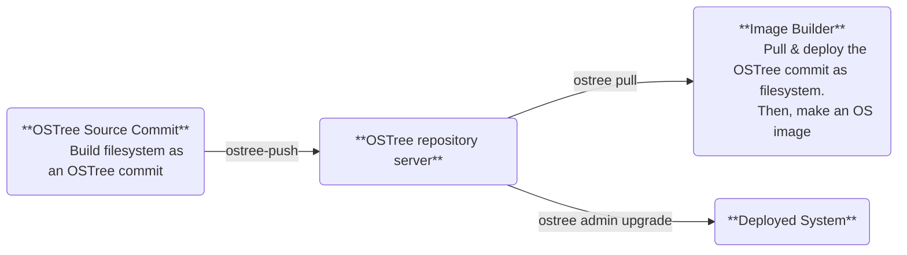
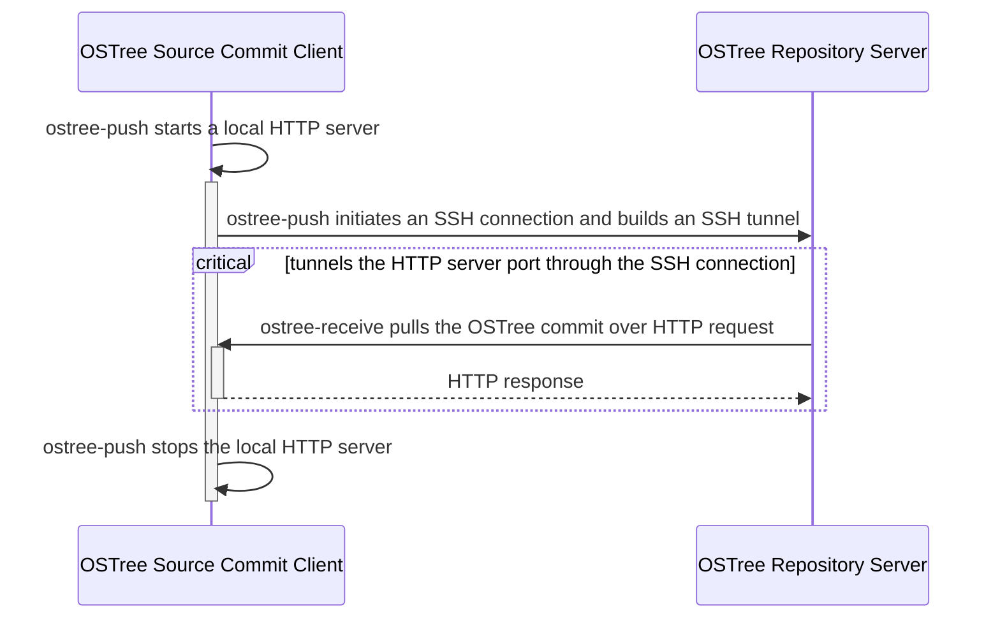
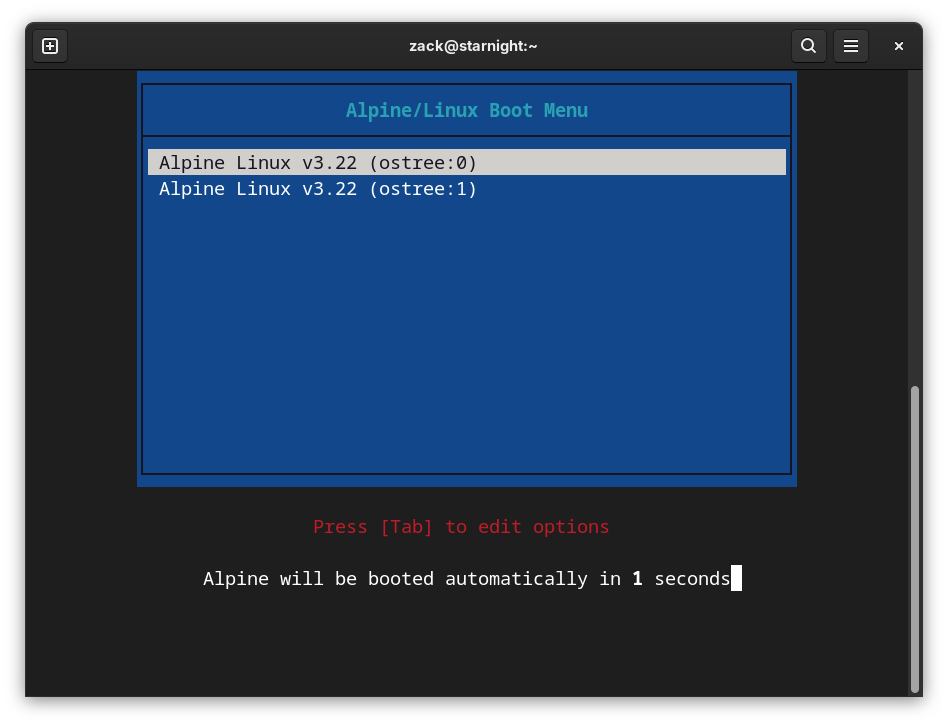

# ostree-build-fs

This provides scripts and YAMLs to:
* Build a root filesystem based on [Alpine Linux](https://alpinelinux.org/). Then, make the filesystem as an [OSTree](https://ostreedev.github.io/ostree/introduction/) commit and push to the OSTree repository server.
* Compose an OSTree repository server.
* Pull & deploy the OSTree commit from the OSTree repository server as filesystem. Then, make an OS image with the filesystem maintained by ostree.



This could be an example of how to build an OSTree maintained Linux distribution.

Source code: https://github.com/starnight/ostree-build-fs

## Have an OSTree Repository Server

Use `podman` as the container tool, and `podman-compose` as the compose tool.
```shell
$ podman-compose -f docker/server-cluster.yaml up --remove-orphans
```
According to [docker/server-cluster.yaml](docker/server-cluster.yaml), the cluster has:
* HTTP service listening on `8080` port. The HTTP service is for the connection from `ostree pull` on Image Builder and `ostree admin upgrade` on deployed online systems.

  Note: According to [The archive format](https://ostreedev.github.io/ostree/formats/#the-archive-format) and [archive efficiency](https://ostreedev.github.io/ostree/formats/#archive-efficiency), storing content object in `archive` format mode defined in `repo/config` can be served directly over plain HTTP by a static webserver.

* sshd service listening on `2222` port. The sshd service is for the connection from OSTree Source Commit Client. It must allow **TCP forwarding** and **Gateway Ports** for the ssh tunnel built by `ostree-push`.

Note: Other container tools are available, too. For example, `docker` and `docker-compose`.

Note: Please ensure firewall rules are properly configured.

## OSTree Source Commit Client

Build a new OSTree Commit on a client

### Prepare

Prepare the environment to build OSTree commit, including the tool [ostree-push](https://github.com/dbnicholson/ostree-push) as a container image:
```shell
$ podman build -t localhost/source-client:latest . -f docker/source-client.Dockerfile
```

### Build a New OSTree Commit, and Ship It

1. Run a container with `source-client` image to bootstrap an Alpine root filesystem to the local folder: `target`
2. Make the root filesystem as a new OSTree commit
3. `ostree-push` the OSTree commit to the OSTree Repository Server:
```shell
$ podman run -it --rm -v ./scripts:/root/scripts -v ./data:/root/data -w /root \
    --network host localhost/source-client:latest sh
# scripts/ostree-commit-push.sh \
    --user <account, for example ostreejob> \
    --server <OSTree repository server (SSH port), for example localhost:2222> \
    --branch <OSTree branch, for example foo>
```

Note: You will need to input the user's password to the SSH service of OSTree Repository Server during `ostree-push`. The default user & password are "ostreejob:ostreejob". To avoid type ssh user's password everytime, use `ssh-copy-id` to copy the public key to the sshd server. CI/CD may need this design. More details in [ssh-copy-id Command with Examples](https://linuxopsys.com/ssh-copy-id-command).

According to [ostree-push's Operation](https://github.com/dbnicholson/ostree-push?tab=readme-ov-file#operation), draw the description as the following sequence diagram:


## Image Builder

### Prepare

Have a machine with Alpine system. Here is going to use a virtual machine as the example.
1. Please follow "Installing Alpine in a virtual machine"'s [Before You Start](https://wiki.alpinelinux.org/wiki/Installing_Alpine_in_a_virtual_machine#Before_You_Start) and [Create the Virtual Machine](https://wiki.alpinelinux.org/wiki/Installing_Alpine_in_a_virtual_machine#Create_the_Virtual_Machine) to have an Alpine virtual machine.
2. Then, run the virtual machine with a network interface and share `ostree-build-fs` folder from host into the guest OS with 9p protocol:
```shell
$ qemu-system-x86_64 -m 512 -nic user -hda <path to the downloaded alpine.qcow2> \
    -fsdev local,id=test_dev,path=<path to ostree-build-fs on host>,security_model=mapped \
    -device virtio-9p-pci,fsdev=test_dev,mount_tag=test_mount \
    -enable-kvm -nographic -serial mon:stdio
# mount -t 9p -o trans=virtio test_mount /mnt
# cd /mnt
```
3. Make sure packages: `ostree`, `multipath-tools` and `sfdisk` are installed.

### Pull & Deploy the OSTree Commit and Make Image

1. Create a RAW disk image as `disk.img` with 2 partitions and label them as `BOOT` and `ROOT` partitions.
2. Create a local folder: `target` as the target root filesystem.
3. Mount the `ROOT` partition to the `target` folder. And, mount `BOOT` partition to `target/boot`.
4. Create a local OSTree repository into `target`.
5. Add a remote OSTree repository address to the local OSTree repository.
6. Pull OSTree commits from the remote OSTree repository to the local OSTree repository.
7. Deploy the OSTree commit to the local folder: `target` as the filesystem.
8. Prepare the bootlader and related config (here is [syslinux](https://wiki.alpinelinux.org/wiki/Bootloaders#Syslinux) as the example) into `target/boot` for `BOOT` partition.

Here is the example to generate the `disk.img` in RAW format:
```shell
# scripts/make-image.sh \
    --url <OSTree repository server's URL, for example http://foo.bar/repo/> \
    --branch <OSTree branch, for example foo> \
    --output <Output disk image's filename, for example disk.img>
```
Note: If the OSTree commit has not been signed by a vailable GPG key, for example in development environment, then it will hit error: GPG verification enabled, but no signatures found: `GPG verification enabled, but no signatures found`.
```log
error: Commit cf57fe6522ccaf09c416c4a39a208e66980d8df41a3a45353668ed9653bc69b1: GPG verification enabled, but no signatures found (use gpg-verify=false in remote config to disable)
```
Adding paramter `--no-gpg-verify` to `ostree remote add` is a quick workaround. However, please sign the OSTree commit in production environment! You can consult [`ostree-commit`](https://ostreedev.github.io/ostree/man/ostree-commit.html) for more signing commit information.

## Deployed System Upgrade

### Prepare

Run a new virtual machine with the new built disk image:
```shell
$ qemu-system-x86_64 -m 512 -nic user \
    -drive format=raw,file=<path to the new built disk image> \
    -enable-kvm -nographic -serial mon:stdio
```

### Upgrade

If there is a new commits pushed to the OSTree Repository Server, then OSTree deployed system can upgrade to the commit:
```
# ostree admin upgrade
```
Check the OSTree status:
```
# ostree admin status
  alpine 6754b38875883e8a3f05db27022304340ebf2e553d07974e150282523ba6fdd0.0 (pending)
    origin refspec: alpine:os/x86_64/main
* alpine f0fd1d6b50fc2eb390dd7088ecad6357606aa397cf27e6c8537d0051dd65e5a3.0
    origin refspec: alpine:os/x86_64/main
```
The new OSTree will be shown as "pending" and used for next boot by default. And, this `ostree admin upgrade` detects the bootloader syslinux and generates a new bootloader's config as `/boot/loader/syslinux.cfg`.

Then, of course, reboot the system! During poweroff, the customized OpenRC service `ostree-finalize-staged` will finalize the OSTree commit deployment by `ostree admin finalize-staged` and update the bootloader's config (`/boot/syslinux/syslinux.cfg`) with the new `/boot/loader/syslinux.cfg` automatically. The new deployed environment will be the default item on the bootloader's menu. Finally, system boots into the new OSTree commit deployed environment.


## Reference

* [ostree](https://ostreedev.github.io/ostree/introduction/)
* [ostree-push](https://github.com/dbnicholson/ostree-push)
* [ostree.repo-config — OSTree repository configuration](https://ostreedev.github.io/ostree/man/ostree.repo-config.html)
